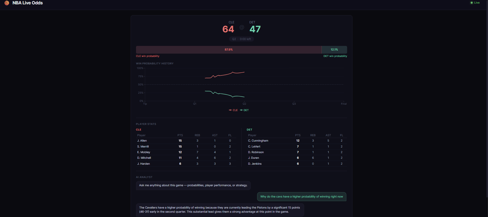
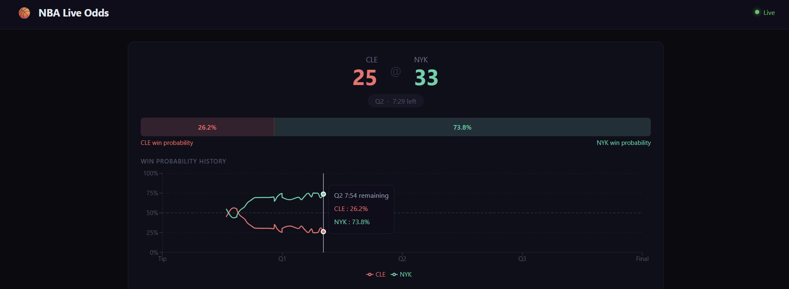
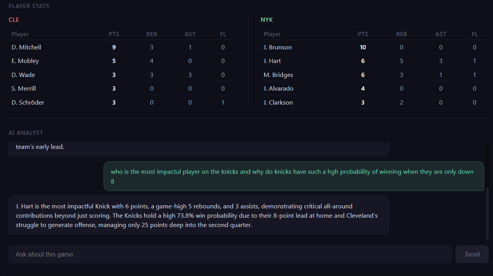

# NBA Live Odds

A real-time NBA win probability dashboard that tracks live games, predicts outcomes using a machine learning model trained on 5 seasons of historical data, and provides an AI game analysis chatbot.

**Live site:** https://nba-live-odds.vercel.app

## What it does

- Tracks live NBA games and updates win probabilities in real time
- ML model trained on 2.8 million play-by-play rows from 2019-2024 seasons
- Win probability chart/graph updates after every scoring play
- Live top 5 player stats from each team showing points, rebounds, assists, and fouls
- AI analyst chatbot answers questions about the current game
- WebSocket connection pushes updates to all connected browsers instantly

## Tech stack

**Machine learning:** Python, XGBoost, scikit-learn, pandas

**Backend:** FastAPI, WebSockets, Redis, PostgreSQL, Docker

**Frontend:** React, Recharts, Vite

**Data:** nba_api (live scoreboard, play-by-play, boxscore)

**AI:** Google Gemini API for live game analysis chatbot

**Deployment:** Vercel (frontend), ngrok (backend tunnel)

## How it works

1. A Python poller fetches live game data from the NBA API every 5 seconds
2. Each update runs through a trained XGBoost model that predicts win probability based on score margin, time remaining, period, and game pace
3. Results are cached in Redis and pushed to all connected browsers via WebSocket
4. The React dashboard updates in real time without page refresh
5. The Gemini chatbot receives live game context with every question

## Model performance

- Accuracy: 75.3%
- Log loss: 0.4768
- Brier score: 0.1614
- Trained on 2.8 million rows across 5,829 games (2019-2024 regular season)

## Running locally

1. Clone the repo
2. Install Python dependencies: `cd backend && pip install -r requirements.txt`
3. Install Node dependencies: `cd frontend && npm install`
4. Add a `.env` file in `backend/` with your Gemini API key
5. Start Docker Desktop
6. Double click `start.bat`
7. Visit `http://localhost:5173`

## Screenshots

